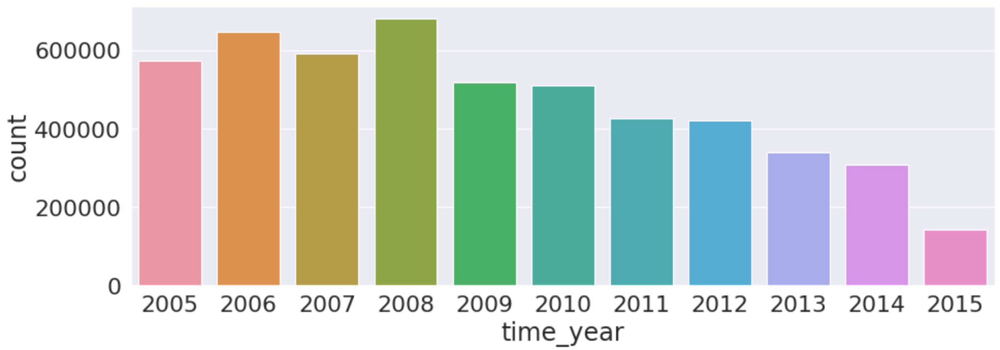
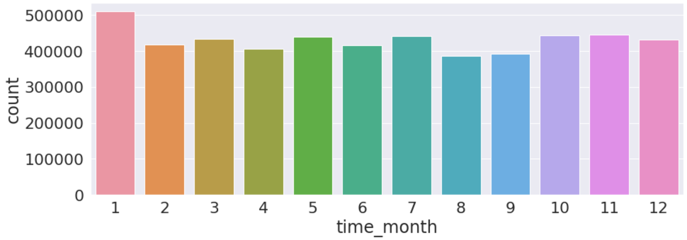
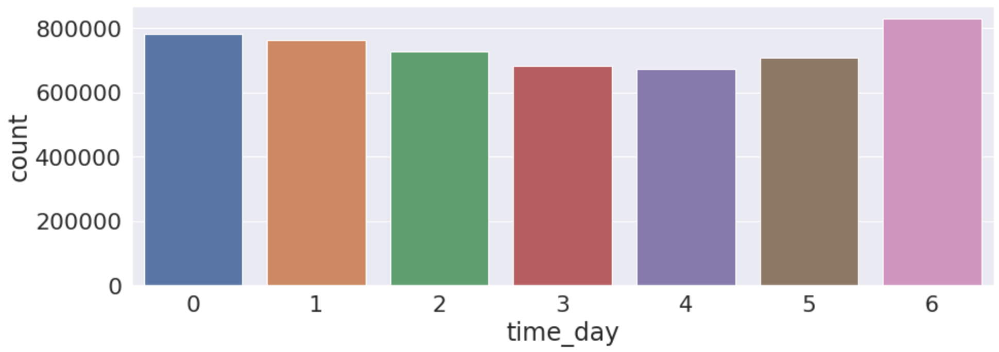
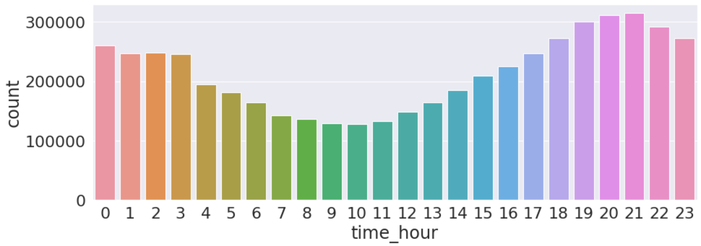
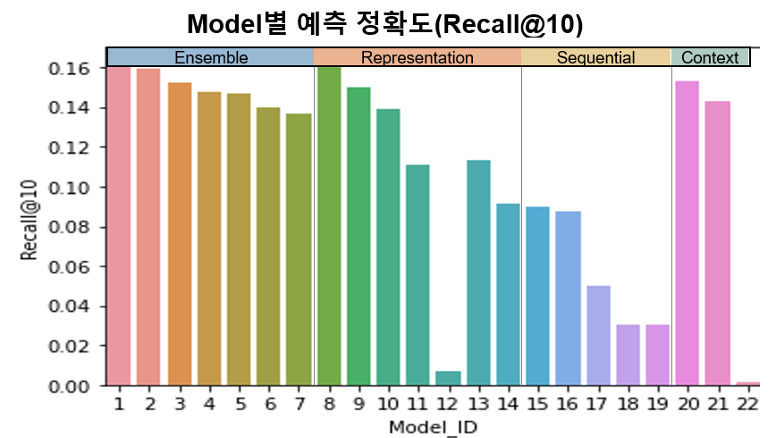
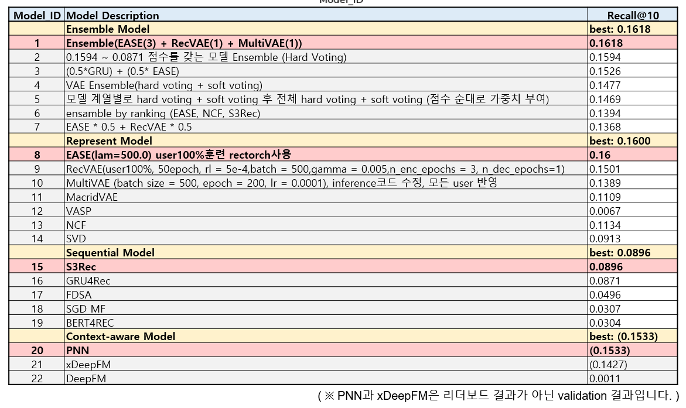
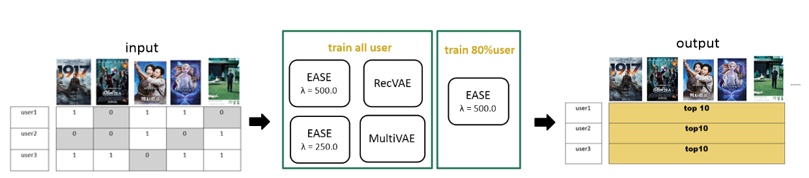

# Wrap Up report

**RecSys 3조**

강영석, 김수희, 김예지, 이현우, 홍수연   

</br>

## 1. **프로젝트 개요**

| 프로젝트 주제 | Movie Recommendation |
| --- | --- |
| 프로젝트 개요 | 사용자의 영화 시청 이력 데이터를 바탕으로 사용자가 다음에 시청할 영화 및 좋아할 영화를 예측합니다. |

### 개발환경

```markdown
- IDE : VSCode
- 협업 Tool : GitHub, Slack, Notion
- Library : pytorch, pandas, recbole, rectorch, surprise
- Server : 개인별 V100 서버 1개, Ubuntu 18.04 
```

### **프로젝트 및 데이터 셋 구조도**

```markdown
📦Recsys03
┣ 📂Deep FM
┣ 📂MultiVAE
┣ 📂NCF
┣ 📂RecVAE
┣ 📂Recbole
┃ ┣ 📂dataset
┃ ┣ 📂log
┃ ┣ 📂output
┃ ┣ 📂recbole
┃ ┣ 📂saved
┣ 📂S3Rec
┣ 📂SGD MF
┣ 📂SVD
┣ 📂Sequential Models
┃ ┣ 📂config
┃ ┣ 📂FDSA
┃ ┣ 📂GRU4REC
┣ 📜.gitignore
┣ 📜README.md
┗ 📜requirements.txt
```
</br>

## 2. 프로젝트 팀 구성 및 역할

- **강영석** : Recbole을 이용한 sequential model, VAE model, inference 제작, Ensemble
- **김수희** : AE기반 모델 , Ensemble
- **김예지** : NCF, SVD and Ensemble
- **이현우** : Context-aware model (DeepFM, PNN)
- **홍수연** : DeepFM, SGD MF and Sequential Model, Ensemble

</br>

## 3. 프로젝트 수행 절차 및 방법
|Name|Date|
|:----|:----|
|EDA|2022.03.21 ~ 2022.03.24|
|Baseline test|2022.03.22 ~ 2022.03.26|
|Model Test|2022.03.25 ~ 2022.04.10|
|RecSys Library 적용|2022.03.28 ~ 2022.04.13|
|Ensemble|2022.04.11 ~ 2022.04.14|

</br>

## 4. 프로젝트 수행 결과

</br>

### **- EDA**
 

 

train 데이터셋에서 user 당 최소 16건 이상, 최대 2912건이며 1인당 평균값은 약 164건, 중앙값은 약 114건입니다. 

데이터의 sparsity ratio는 약 97.6%로 일반적인 추천 시스템 데이터셋에 비해 굉장히 dense한 데이터입니다.

시청 기록이 매해 조금씩 줄어드는 양상을 띄며 계절과는 무관한 것을 확인했습니다. 가장 많이 영화를 시청하는 날은 토요일이며, 퇴근 직후 저녁 시간에 많이 시청한다는 것을 확인할 수 있었습니다.

평점이 없는 데이터라는 점에서 CTR을 활용하기 위해 user가 같은 영화를 본 횟수의 max값을 구했으나 확인결과 user가 같은 영화를 중복해서 보지 않았다는 것을 파악했습니다. 이를 통해 CTR을 활용할 수 없다는 판단을 했습니다. 

sequential model만 사용하기에 데이터 중간마다 sampling하여 test dataset으로 구성했다는 대회 안내사항을 고려하여 최대한 다양한 model을 실험하여 **implicit data에 적합한 모델을 찾기**로 결정했습니다.

</br>

### **- Model**

- **Representation Model**
    - MultiVAE : multinomial distribution (분포합은 1 , 이미 시청한 아이템에는 더 많은 확률질량을 줌 → implicit data 모델링에 적합)
    - RecVAE : MultiVAE가 고차원 sparse matrix를 input / output으로 사용하면서 다른 부분의 매개 변수를 손상 시킬 수 있는 불안정함을 composit prior(encoder)를 통해 개선한 모델
    - EASE : hidden layer를 두지 않고 closed form연산을 통해 output도출
    - MacridVAE : KL divergence term을 활용해서 가까운 거리의 아이템을 서칭하는 VAE 모델
    - VASP : FLVAE , Neural EASE 병렬로 학습
    - NCF : Neural Network를 이용한 Collaborative filtering 모델
    - SVD : SVD 행렬분해를 이용한 Collaborative filtering 모델
    - SGD MF : SGD를 기반으로 User-Item Interaction을 추정한 최적화 기법
- **Sequential Model**
    - S3Rec: 4개의 mutual information maximization (MIM)을 적용한 self-supervised seq. 모델
    - GRU4Rec : RNN 계열의 session 기반의 추천 모델
    - FDSA : Item 과 Contents feature를 dual self-Attention 구조로 학습한 sequential 모델
    - BERT4Rec : Bi-directional Encoder를 갖춘 Transformer 기반 BERT를 활용한 모델
- **Context-aware Model**
    - xDeepFM: DeepFM모델에 implicit feedback과 explicit feedback을 결합하여 사용하는 모델
    - PNN: product 임베딩 레이어와 interact 정보를 위한 fully connected layer로 이루어진 모델
- **Ensemble**
    - Hard voting, Soft voting, Model Weight 부여

</br>

### **- Test & Evaluation**
<p align="center">

<p>



- 다양한 Model을 test한 결과, MultiVAE, EASE 등 Representation learning을 위한 모델들이 Recall@10 기준으로 0.1600 의 가장 좋은 성능을 보여줬으며, 동일한 representation model들의 ensemble을 수행하면 Recall@10을 기준으로 0.1618로 약 10% 가량 성능 향상을 보였습니다.
- 기타 다른 모델들도 단일로 적용했을 때 보다는 ensemble 적용 시 성능이 향상됨을 확인할 수 있었습니다.

</br>

### **- 최종 모델 선정 및 분석**

1. **Architecture : EASE(3) + RecVAE(1) + MultiVAE(1)**
Leaderboard Score : 0.1618
    
    
    
    - Representation을 잘 하는 모델을 훈련하여 결과를 도출하는 것이 이번 대회에서 가장 중요한 부분이라고 생각하여 AE기반의 모델들을 Ensemble 했습니다.
    - 성능이 잘 나온 모델에는 적은 가중치를 주고 그렇지 않은 모델에는 높은 가중치를 주어 AE기반 모델에서 뽑을 수 있는 top10을 골고루 뽑으려고 했습니다.
    
2. **Architecture : EASE**
Leaderboard Score : 0.1600
Lambda : 500.0
    - Data를 split 하지 않고 train에 100% 사용하여 0.0367 성능을 향상시켰습니다.
    - Hyperparameter tuning을 사용해서 lambda 값을 조정하여 0.0006 성능을 향상시켰습니다.

</br>

### **- Reference**

- RecBole ([https://recbole.io/](https://recbole.io/)) , RecTorch([https://github.com/makgyver/rectorch](https://github.com/makgyver/rectorch)), Surprise([http://surpriselib.com/](http://surpriselib.com/))

